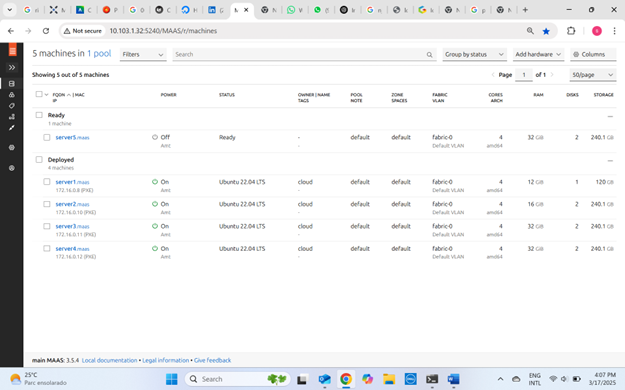
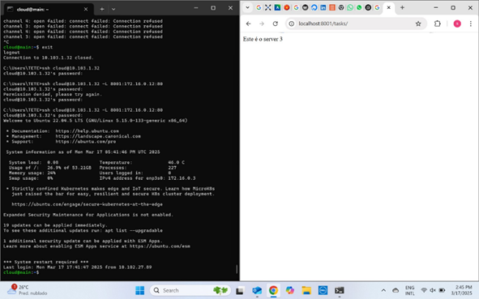

## Objetivo

O objetivo deste roteiro é documentar a instalação e verificação do PostgreSQL, a implantação do Django em diferentes servidores (tanto manualmente quanto via Ansible) e a configuração do Nginx para gerenciar o tráfego de forma centralizada.

## Montagem do Roteiro

Os pontos “tarefas” são os passos que devem ser seguidos para a realização do roteiro. Eles devem ser claros e objetivos, com evidências de que foram realizados.

---

### Tarefa 1: Verificação do PostgreSQL

Após instalarmos o PostgreSQL, foi necessário verificar se ele estava funcionando corretamente. Para isso, utilizamos os seguintes comandos:

- `systemctl status postgresql`  
- `telnet localhost 5432`  
- `telnet [IP do server 1] 5432`  

A porta 5432 é a porta padrão do PostgreSQL. Esses testes comprovam:

1. Que o serviço está ativo no sistema operacional.  
2. Que é acessível na própria máquina em que foi instalado.  
3. Que é acessível a partir de uma conexão vinda da máquina MAIN.  
4. Em qual porta o serviço está rodando.

#### Evidências (Imagens)

**Figura 1**: Verificando o status do PostgreSQL.

---

### Tarefas 2 e 3: Instalação do Django no Server 2

Foi necessário instalar o Django no server 2, que deve se comunicar com nossa base de dados (PostgreSQL) instalada no server 1. Fizemos o deploy do server 2 e, em seguida, instalamos o Django manualmente, configurando ambiente, dependências e arquivos de forma direta no sistema.

#### Evidências (Imagens)

  
  
  
  
  
  

---

### Tarefa 3.3: Implementação manual do Django e do Banco de Dados

1. Instalamos o Ubuntu 22.04 no server 1 por meio do MAAS Dashboard.  
2. Baixamos e instalamos o PostgreSQL nessa máquina.  
3. Criamos um usuário e um banco de dados para a aplicação.  
4. Editamos o arquivo `postgresql.conf` para aceitar conexões remotas.  
5. Editamos o arquivo `pg_hba.conf` para liberar acesso à subnet.  
6. Liberamos o firewall e reiniciamos o sistema.

Após isso, iniciamos a aplicação em Django:

1. Instalamos o Ubuntu 22.04 no server 2.  
2. Clonamos o repositório do projeto (via Git).  
3. Entramos no diretório do projeto e instalamos a aplicação.

A diferenca da implementacao, foi que para o Postgre, tivemos que acessar o Maas manualmente e fazer o deploy no proprio dashboard. Ja para o Django, pedimos uma maquina no terminal CLI e fizemos o deploy por meio desse tambem.
#### Evidências (Imagens)

  

---

### Tarefa 4: Instalação do Django no Server 3 via Ansible

Nesta tarefa, repetimos a instalação do Django, porém no server 3, de forma automatizada com o Ansible. Em vez de realizar todos os passos manualmente, utilizamos playbooks

Máquinas com os deploys feitos e seus IPs:

- Túnel para o server 2: `172.16.0.10`  
- Túnel para o server 2: `172.16.0.11`

A diferença é que, ao instalar manualmente a aplicação Django, todos os passos necessários nós fizemos manualmente , o que levou mais tempo e poderiamos ter cometido algum erro. Já com o Ansible, todo esse processo é automatizado por meio de playbooks, garantindo padronização. Isso reduz significativamente o tempo necessário para configurar novos servidores e minimiza erros, além de que se desejarmos exapndir colocando mais maquinas com django, basta replicar a instalação que será identica para todos

#### Evidências (Imagens)

  
  

---

### Tarefa 5: Deploy do Nginx no Server 4

Na tarefa 5, fizemos o deploy no server 4 e instalamos o Nginx, que atua como gerenciador de tráfego. Ele direciona as requisições para o server 2 ou o server 3, conforme a disponibilidade, sem que seja necessário acessá-los individualmente.

Depois disso, configuramos o server 4 (IP `172.16.0.12`) para encaminhar as páginas do Django provenientes do server 2 ou server 3. Em seguida, criamos um túnel da máquina local para o server 4, permitindo acessar as páginas do Django por meio de um único ponto de entrada.

#### Evidências (Imagens)

  
  

### Conclusão 

Foi possível aprender tanto como instalar manualmente como de forma automatizada, além de tambem 
ser possível acessar os dashboards dos softwares instalados.

---

