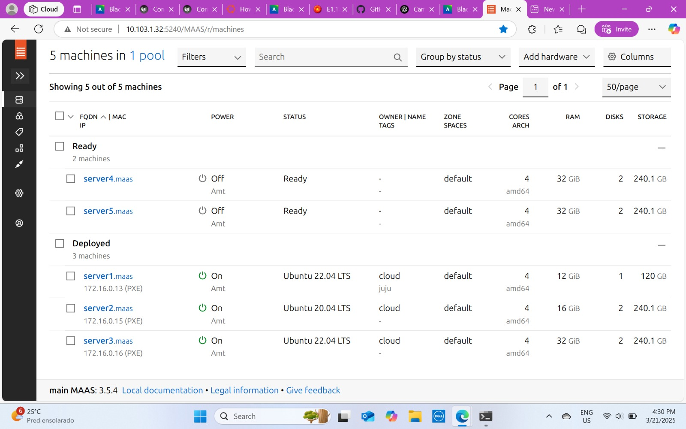
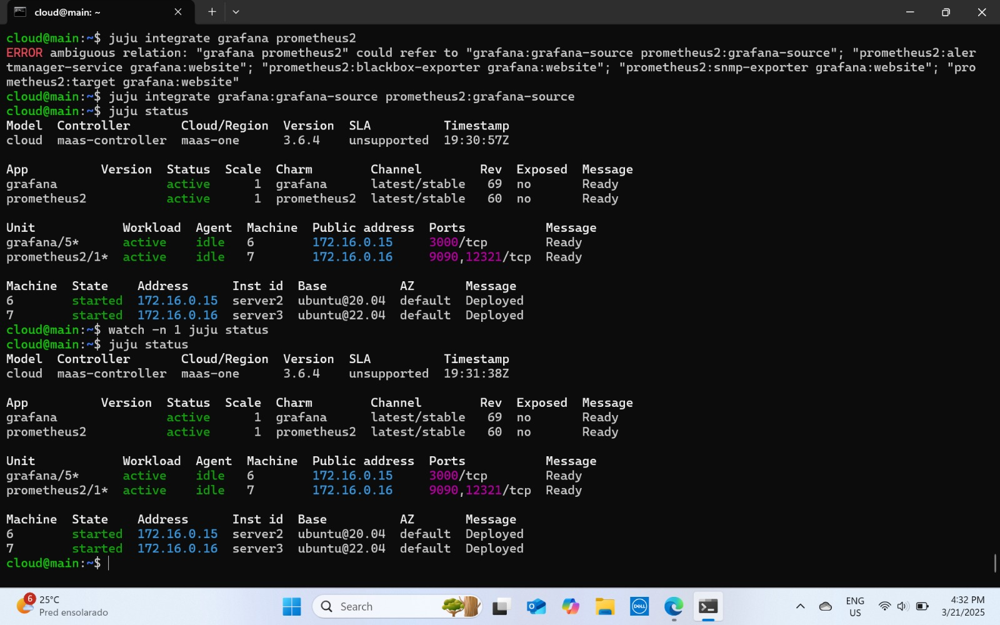
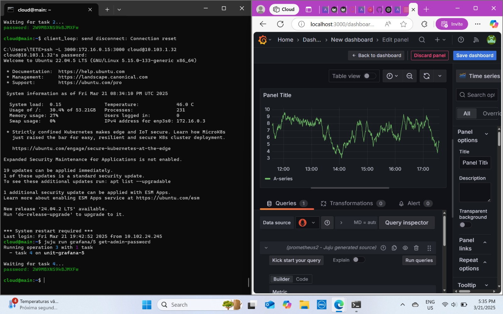
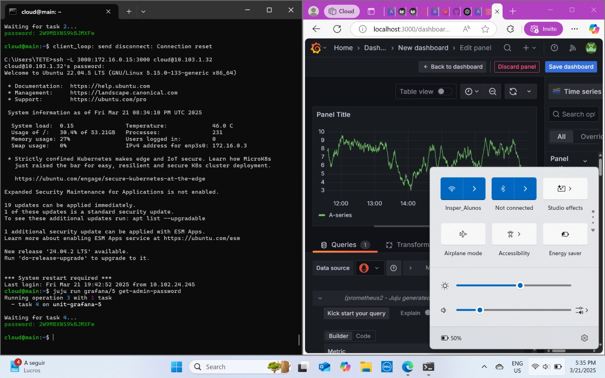
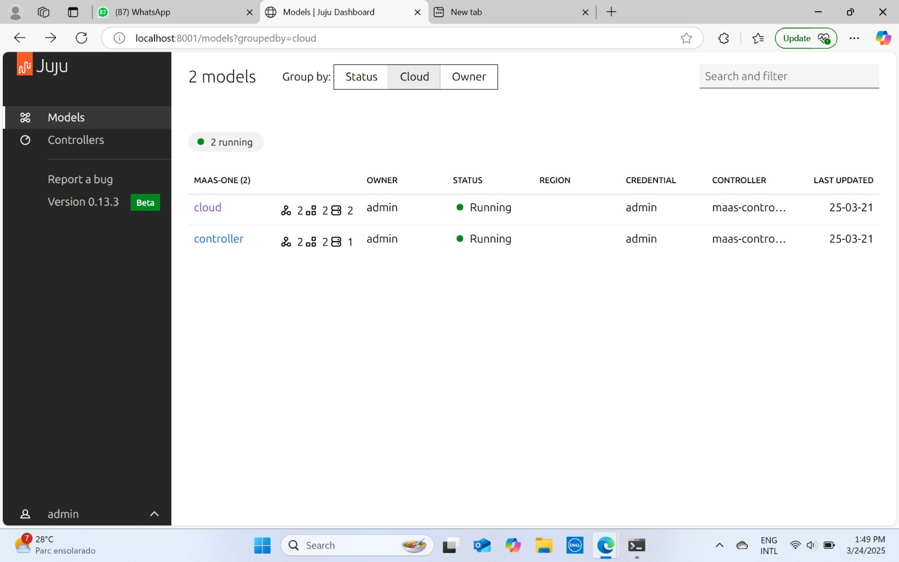

### Objetivos

1  - Entender os conceitos básicos sobre uma plataforma de gerenciamento de aplicações distribuídas.

2  - Entender os conceitos básicos de comunicação entre aplicações e serviços.

### O que foi feito

Primeiro, instalamos as linhas de comando do Juju no _main_ para possibilitar a instalação do Juju no _server1_, bem como do Juju Dashboard em uma máquina virtual criada dentro do _server1_ (máquina 0). Assim, foi possível instalar as aplicações **Grafana** e **Prometheus2** nas máquinas 2 e 3, respectivamente. Em seguida, conectamos o Grafana ao Prometheus e, dessa forma, conseguimos visualizar os dados coletados pelo Prometheus diretamente no dashboard do Grafana.

### Evidências

####_Dashboard_ do MAAS
  
####Juju status com o grafena _Active_
  
####_Dashboard_ do Grafana com o Prometheus de _source_

####_Dashboard_ a partir da rede do Insper
  

####Aplicações sendo gerenciadas pelo JUJU

### Conclusão 

Foi possível perceber que o Juju é um excelente orquestrador de Softwares

---

